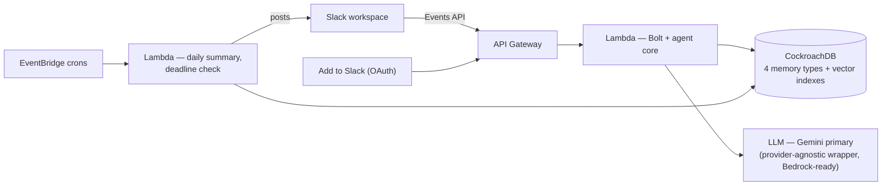

# Griot

**An AI teammate with institutional memory — it remembers what your team decided, flags contradictions, and never forgets a task.**

[](LICENSE)
[](tsconfig.base.json)
[](package.json)

Griot lives in your Slack workspace. Teach it how your team works, and it answers questions from that knowledge, remembers decisions (and pushes back when a new one contradicts an old one), tracks tasks in plain language, and keeps the rhythm with daily summaries and morning deadline checks.

## What it does

| You say | Griot does |
| ------- | ---------- |
| `@Griot what's our refund policy?` | Answers from the team knowledge base — grounded RAG, and it says *"Not sure — that's not in my knowledge base yet"* rather than inventing facts |
| `@Griot learn Our standard rate is $50/hour` | Stores the fact in semantic memory (chunked, embedded, vector-indexed) |
| `@Griot we're switching to monthly invoicing` | Detects the decision and logs it — and if it contradicts earlier knowledge or a past decision, it still logs it but **pushes back quoting the earlier rule** (the Conflict Guard) |
| `@Griot forget that` | Undoes the latest decision (soft delete — nothing is ever lost) |
| `@Griot Ada is to design the flyer by Friday` | Creates a todo with owner and deadline parsed from plain language |
| `@Griot the flyer is ready` | Matches the message against open todos and closes the right one |
| `@Griot what's pending?` | Lists open tasks, soonest deadline first |
| `@Griot research what similar tools charge per seat` | Looks it up with live web search (grounded) and replies with findings plus a Sources line |
| `@Griot why did you say that?` | Explains its last answer's provenance — which stored memories it quoted, how closely they matched, and when they were learned |
| `@Griot replace the old rule` | After the Conflict Guard flags a contradiction, retires the old rule so only the new decision is retrieved from then on |
| *(automatic, evening)* | Posts a daily summary in every channel with real activity |
| *(automatic, morning)* | Posts due-today and overdue task reminders where the tasks were created |

No slash commands, no syntax to learn — @mention it and talk normally. An intent classifier routes each message.

## The memory model

Four memory types, all in CockroachDB, all keyed by `workspace_id` — multi-tenant from the first row:

| Memory type | Table | What it holds |
| ----------- | ----- | ------------- |
| **Semantic** | `knowledge` | Facts the team teaches it — `VECTOR(768)` embeddings behind a cosine vector index, retrieved top-k per question (RAG) |
| **Episodic** | `decisions` | Team decisions — append-only, vector-indexed for conflict matching, `forget` is a soft delete so the audit trail survives |
| **Task** | `todos` | Tasks with owners, deadlines (resolved in the team's timezone), and the channel they came from |
| **Working** | `messages` | A rolling window of recent conversation per channel — including Griot's own replies, so multi-turn context and self-consistency survive |

Every answer is assembled from semantic matches plus the working-memory window; every new decision is vector-matched against both knowledge and past decisions before Griot decides whether to warn.

### Memory lifecycle

Memories don't just accumulate — they carry provenance and can be retired:

- **Provenance** — every RAG answer stores exactly which knowledge chunks went into its prompt (id, snippet, similarity, when learned) on the reply's `messages` row. Ask *"why did you say that?"* and Griot cites its own memory instead of hand-waving.
- **Supersession** — when the Conflict Guard flags a new decision, it records *which* memory it contradicts. Say *"replace the old rule"* and the old decision or fact is marked superseded (`superseded_at`, never deleted) and excluded from all retrieval — RAG, conflict matching, everything — from then on. The audit trail stays intact.

## Architecture



npm-workspaces monorepo, TypeScript strict throughout, no ORM:

- **`packages/db`** — CockroachDB access layer: `pg` pool with TLS, plain-SQL migrations (tracked in `schema_migrations`), typed query helpers. Owns `EMBEDDING_DIM = 768` — the single source of truth the schema, seeding, and querying all share, because an embedding-dimension mismatch doesn't error, it just silently breaks retrieval.
- **`packages/agent`** — the reasoning core: a provider-agnostic LLM wrapper (`complete` + `embed`, retries with jittered backoff, 30s timeouts) with Gemini as primary and a Bedrock stub behind `LLM_PROVIDER`; every prompt template; intent parsing; the scheduled jobs.
- **`packages/slack`** — Bolt app with two entrypoints sharing one set of listeners: Socket Mode for local dev, `AwsLambdaReceiver` for production. Also the OAuth install flow and the cron handler.

## Hackathon tool usage

**CockroachDB:**
- **Distributed vector indexing** — `knowledge` and `decisions` both carry a cosine vector index (`CREATE VECTOR INDEX ... (workspace_id, embedding vector_cosine_ops)`). The `workspace_id` prefix column means similarity search is tenant-isolated *at the index level*: a query can only ever scan its own workspace's vectors.
- **Managed MCP Server** — connected to Claude Code throughout development for schema inspection, query verification (vector index syntax was validated against the live cluster before the migration was written), and data checks.

**AWS:**
- **Lambda** — the entire agent runtime: event handling, OAuth, and scheduled jobs.
- **API Gateway** — fronts the Slack Events API endpoint and the OAuth install/redirect pages.
- **EventBridge** — two cron schedules (evening summary, morning deadline check) fanning into the job Lambda across all installed workspaces.

## Production notes

- **Idempotent event handling** — Slack redelivers events on slow acks; message writes dedupe on a unique `(workspace_id, slack_event_id)` index, and a retry guard skips reprocessing mentions.
- **Per-workspace tokens** — the OAuth flow stores a bot token per workspace; Bolt authorizes each event against the `workspaces` table (with an HMAC-signed, 10-minute state parameter on the install flow for CSRF protection).
- **Tenant isolation** — every table and every vector index is keyed/prefixed by `workspace_id`; no query path exists that crosses workspaces.
- **Audit story** — decisions are append-only; `forget` sets `deleted_at` rather than deleting, so the full history remains inspectable.
- **Rate limits** — Slack clients wait out 429s honoring `retry-after` (`rejectRateLimitedCalls: false`), cron posts run sequentially per workspace, and the LLM wrapper retries 429/5xx with jittered exponential backoff.
- **Graceful failure** — LLM or database trouble produces a visible *"Something went wrong on my side — try again in a moment."* rather than silence, and one workspace's failure never blocks another's cron run.
- **Least privilege** — the database credential is a dedicated SQL user scoped to this database; secrets live in SST secrets (deploy) and `.env` (local, gitignored).

## Self-hosting

### Prerequisites

- Node.js ≥ 22 and npm
- A [CockroachDB Cloud](https://cockroachlabs.cloud) cluster (the free tier works) on v25.2+ (vector indexes)
- A [Gemini API key](https://aistudio.google.com/apikey)
- An AWS account with credentials configured locally (for deploys)
- A Slack workspace where you can create apps

### 1. Clone and install

```sh
git clone https://github.com/IwuchukwuDivine/griot.git
cd griot && npm install
cp .env.example .env
```

### 2. Database

Create a SQL user in your CockroachDB cluster, put its connection string in `.env` as `DATABASE_URL`, then:

```sh
npm run db:migrate
```

### 3. Slack app

Create an app at [api.slack.com/apps](https://api.slack.com/apps) (from scratch), then configure:

- **OAuth & Permissions → Bot Token Scopes:** `app_mentions:read`, `chat:write`, `channels:history`, `im:history`, `im:write`, `users:read`, `commands`
- **Event Subscriptions → Subscribe to bot events:** `app_mention`, `message.channels`
- **Socket Mode** (for local dev): enable it and create an app-level token with `connections:write`
- Install the app to your workspace

Copy into `.env`: the bot token (`SLACK_BOT_TOKEN`), app token (`SLACK_APP_TOKEN`), signing secret (`SLACK_SIGNING_SECRET`), and from Basic Information the client id and secret (`SLACK_CLIENT_ID`, `SLACK_CLIENT_SECRET`). Add your `GEMINI_API_KEY` and set `TZ` to your team's timezone.

### 4. Run locally

Register your dev workspace (the OAuth flow does this in production; locally, insert the row once — your team id starts with `T` and is in the URL when you open Slack in a browser):

```sql
INSERT INTO workspaces (workspace_id, team_name, status) VALUES ('T0XXXXXXX', 'Dev', 'active');
```

```sh
npm run dev
```

Invite `@Griot` to a channel and say hi. Useful scripts: `npm run build` / `npm run typecheck` (all workspaces), `npm run job:summary` / `npm run job:deadline` (run the cron jobs once, locally).

### 5. Deploy

```sh
npx sst secret set SlackSigningSecret <value>
npx sst secret set SlackBotToken <value>
npx sst secret set DatabaseUrl <value>
npx sst secret set GeminiApiKey <value>
npx sst secret set SlackClientId <value>
npx sst secret set SlackClientSecret <value>
npm run build && npx sst deploy
```

Then wire the deployed URLs back into the Slack app:

- `slackEventsUrl` → **Event Subscriptions → Request URL**
- `oauthRedirectUrl` → **OAuth & Permissions → Redirect URLs**
- To let other workspaces install: **Manage Distribution → Activate Public Distribution**, then share `installUrl` — that's the "Add to Slack" link. Installing creates the workspace row, refreshes tokens on re-install, and DMs the installer a quick-start note.

The crons (summary 17:00 UTC, deadline check 07:30 UTC) deploy with it; adjust the schedules in `sst.config.ts`.

## Contributing

See [CONTRIBUTING.md](CONTRIBUTING.md).

## License

[MIT](LICENSE) © 2026 Deevyn Ifunanya
